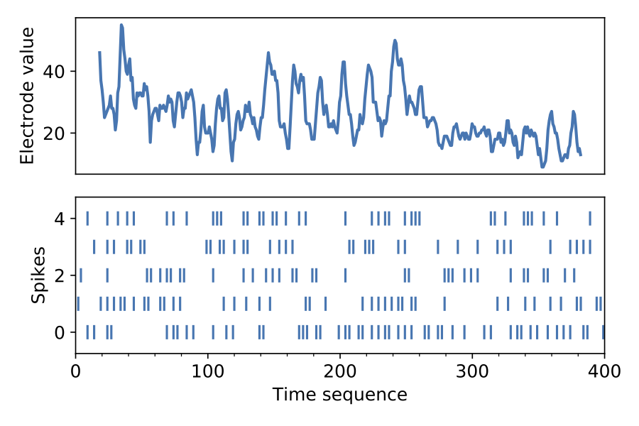

Touch is arguably the most important sensing modality in physical interactions. However, tactile sensing has been largely under-explored in robot applications owing to the complexity in making perceptual inferences until the recent advancements in machine learning or deep learning in particular. Touch perception is strongly influenced by both its temporal dimension similar to audition and its spatial dimension similar to vision. While spatial cues can be learned episodically, temporal cues compete against the system’s response/reaction time to provide accurate inferences.  

<tag style="font-size:14px">Fig. 1. An exmple of threshold encoding on tactile data</tag>
 

In this paper, we propose a fast tactile-based texture classification framework which makes use of the spiking neural network to learn from the neural coding of the conventional tactile sensor measurements. The framework is implemented and tested on two independent tactile datasets collected in sliding motion on 20 material textures. Our results show that the framework is able to make much more accurate inferences ahead of time as compared to that by the state-of-the-art learning approaches.

<tag style="font-size:14px">Fig. 2. t-SNE on encoded spike trains</tag>
 

<i>For more info, please read the following article:</i>
<b>The paper is accepted. The pdf link is coming on the way :) </b>
<a href="https://github.com/dexrob/fast_texture_recognition.git">Code</a>&nbsp;<a href="https://github.com/dexrob/tactile_data_IROS2020_preprocessed.git">Data</a> 

<!-- Note: Change the citation info later, once the pdf is ready, -->
<!-- <ul>
	<li>
		Taunyazov, Tasbolat; Koh, Hui Fang; Wu, Yan; Cai, Caixia; Soh, Harold.  
		<b>Towards effective tactile identification of textures using a hybrid touch approach.</b>  
		2019 International Conference on Robotics and Automation (ICRA), pp. 4269-4275, IEEE, Montreal, Canada, 2019, ISBN: 978-1-5386-6027-0. 
		<a href="https://www.yan-wu.com/docs/taunyanov2019towards.pdf">Pdf</a> &nbsp; <a href="">Data</a> &nbsp;<a class="collapsible">Cite</a>
		

		 
		@inproceedings{taunyazov2019towards,  
		  title={Towards effective tactile identification of textures using a hybrid touch approach}, 
		  author={Taunyazov, Tasbolat and Koh, Hui Fang and Wu, Yan and Cai, Caixia and Soh, Harold}, 
		  booktitle={2019 International Conference on Robotics and Automation (ICRA)}, 
		  pages={4269--4275}, 
		  year={2019}, 
		  organization={IEEE} 
		}
		

	</li>
</ul> -->

