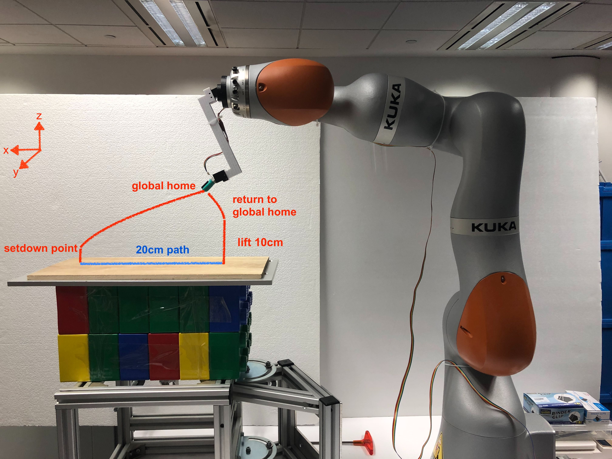
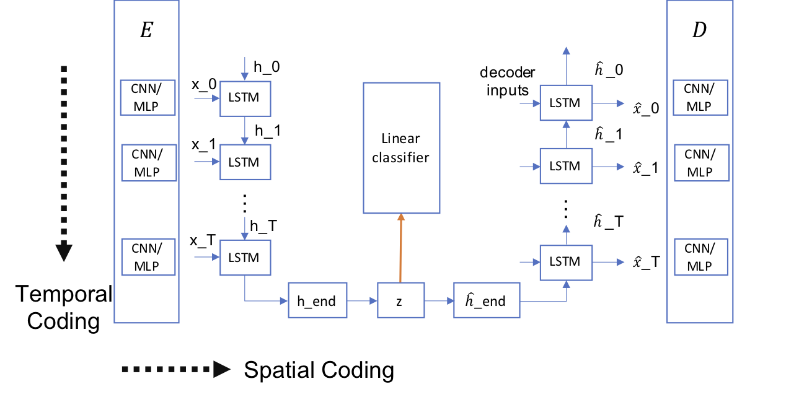

The sense of touch is an essential sensing modality for a robot to interact with the environment as it provides rich and multimodal sensory information upon contact. It enriches the perceptual understanding of the environment and closes the loop for action generation. One fundamental area of perception that touch dominates over other sensing modalities, is the understanding of the materials that it interacts with, for example, glass versus plastic. However, unlike the senses of vision and audition which have standardized data format, the format for tactile data is vastly dictated by the sensor manufacturer, which makes it difficult for large-scale learning.  

<tag style="font-size:14px">Fig. 1. KUKA robot setup for collection of BioTac data </tag>
 

This paper investigates the joint learnability of data collected from heterogeneous tactile sensors performing a touch sequence on some common materials. We propose a supervised recurrent autoencoder framework to perform joint material classification task to improve the training effectiveness. The framework is implemented and tested on the two sets of tactile data collected in sliding motion on 20 material textures using the iCub RoboSkin tactile sensors and the SynTouch BioTac sensor respectively. Our results show that the learning efficiency and accuracy improve for both datasets through the joint learning as compared to independent dataset training. This suggests the usefulness for large-scale open tactile datasets sharing with different sensors.

<tag style="font-size:14px">Fig. 2. The proposed recurrent autoencoder framwork with classifier</tag>
 

<i>For more info, please read the following article:</i>
<b>The pdf link is coming on the way :) </b>

<!-- Note: Change the citation info later, once the pdf is ready, -->
<!-- <ul>
	<li>
		Taunyazov, Tasbolat; Koh, Hui Fang; Wu, Yan; Cai, Caixia; Soh, Harold.  
		<b>Towards effective tactile identification of textures using a hybrid touch approach.</b>  
		2019 International Conference on Robotics and Automation (ICRA), pp. 4269-4275, IEEE, Montreal, Canada, 2019, ISBN: 978-1-5386-6027-0. 
		<a href="https://www.yan-wu.com/docs/taunyanov2019towards.pdf">Pdf</a> &nbsp; <a href="">Data</a> &nbsp;<a class="collapsible">Cite</a>
		

		 
		@inproceedings{taunyazov2019towards,  
		  title={Towards effective tactile identification of textures using a hybrid touch approach}, 
		  author={Taunyazov, Tasbolat and Koh, Hui Fang and Wu, Yan and Cai, Caixia and Soh, Harold}, 
		  booktitle={2019 International Conference on Robotics and Automation (ICRA)}, 
		  pages={4269--4275}, 
		  year={2019}, 
		  organization={IEEE} 
		}
		

	</li>
</ul> -->

