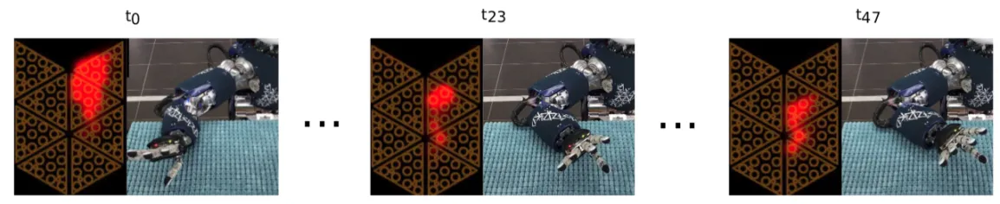

Empowering robots with the sense of touch may augment their understanding of interacted objects and the environment beyond standard sensory modalities (e.g., vision). This work investigates the effect of hybridizing touch and sliding movements for tactile-based texture classification.

Tactile Sensor activations while sliding the iCub Fore-arm across a textured surface.

We develop three machine-learning methods within a framework to discriminate between surface textures; the first two methods use hand-engineered features, whilst the third leverages convo- lutional and recurrent neural network layers to learn feature representations from raw data.

To compare these methods, we constructed a dataset comprising tactile data from 23 textures gathered using the iCub platform under a loosely constrained setup, i.e., with nonlinear motion. In line with findings from neuroscience, our experiments show that a good initial estimate can be obtained via touch data, which can be further refined via sliding; combining both touch and sliding data results in 98% classification accuracy over unseen test data.

<i>For more info, please read the following article:</i>

<ul>
	<li>
		Taunyazov, Tasbolat; Koh, Hui Fang; Wu, Yan; Cai, Caixia; Soh, Harold.  
		<b>Towards effective tactile identification of textures using a hybrid touch approach.</b>  
		2019 International Conference on Robotics and Automation (ICRA), pp. 4269-4275, IEEE, Montreal, Canada, 2019, ISBN: 978-1-5386-6027-0. 
		<a href="https://www.yan-wu.com/docs/taunyanov2019towards.pdf">Pdf</a> &nbsp; <a href="">Data</a> &nbsp;<a class="collapsible">Cite</a>
		

		 
		@inproceedings{taunyazov2019towards,  
		  title={Towards effective tactile identification of textures using a hybrid touch approach}, 
		  author={Taunyazov, Tasbolat and Koh, Hui Fang and Wu, Yan and Cai, Caixia and Soh, Harold}, 
		  booktitle={2019 International Conference on Robotics and Automation (ICRA)}, 
		  pages={4269--4275}, 
		  year={2019}, 
		  organization={IEEE} 
		}
		

	</li>
</ul>

